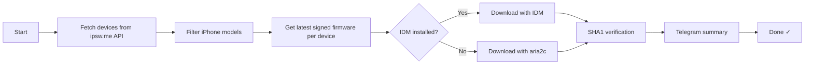

<div align="center">
  <h1>🍏 iPhone Firmware Downloader</h1>
  <p><strong>Automatically download the latest signed iOS IPSW firmware for any iPhone model</strong></p>

  <p>
    
    
    
    
  </p>
</div>

---

## ✨ Features

- **Auto-detects** the latest signed stable firmware for every iPhone model
- **Dual download engine** — uses Internet Download Manager (IDM) or falls back to aria2c
- **SHA1 verification** — validates every file after download
- **Duplicate merging** — intelligently combines multi-identifier devices (e.g. GSM + Global) into a single file
- **Orphan cleanup** — removes stale IPSW files that no longer match any device
- **Telegram notifications** — sends a summary report on completion
- **Stall detection & retry** — monitors progress, retries stalled downloads automatically
- **Graceful shutdown** — safe Ctrl+C handling
- **Resume support** — continues interrupted downloads via IDM / aria2c

## 📋 Requirements

| Software | Purpose |
|----------|---------|
| **Python 3.8+** | Runtime |
| **IDM** (optional) | Faster multi-threaded downloads |
| **aria2c** (auto) | Fallback downloader |

IDM is auto-detected if installed; otherwise `aria2c` is downloaded automatically on first run.

## 🚀 Setup

```bash
# 1. Clone the repo
git clone https://github.com/amrkazafy/iphone-firmware-downloader
cd iphone-firmware-downloader

# 2. (Optional) Add Telegram notifications
echo "BOT_TOKEN=your_telegram_bot_token" > .env
echo "CHAT_ID=your_chat_id" >> .env

# 3. Run
python firmware_downloader.py
```

## ⚙️ How It Works

1. Fetches the full iPhone device list from [ipsw.me](https://ipsw.me) API
2. Filters supported models (iPhone 6 → iPhone 17e / iPhone Air)
3. Resolves the **newest signed stable build** per device
4. Downloads using **IDM** (if available) or **aria2c**
5. Verifies each file against its SHA1 hash
6. Sends a **Telegram summary** if configured



## 📁 File Structure

```
iphone-firmware-downloader/
├── firmware_downloader.py   # Main script
├── .env                     # Telegram token (ignored by git)
├── .gitignore
├── .tools/                  # aria2c auto-downloaded here
├── backup/                  # Previous versions
│   ├── firmware_downloader_v3.py
│   ├── firmware_downloader_v4.py
│   ├── firmware_downloader_v5.py
│   └── firmware_downloader_v6.py
└── *.ipsw                   # Downloaded firmware (ignored by git)
```

## 📊 Output Filename Format

```
Identifier (Device Name)_Version_Build_Restore.ipsw
```

**Example:** `iPhone14,2 (iPhone 13 Pro)_26.5.2_23F84_Restore.ipsw`

For identical firmware shared across variants, files are **merged** and identifiers are joined with `+`:
`iPhone10,3+iPhone10,6 (iPhone X GSM + iPhone X Global)_16.7.16_20H392_Restore.ipsw`

## 🔔 Telegram Integration

To enable notifications, create a bot with [@BotFather](https://t.me/BotFather) and create a `.env` file:

```env
BOT_TOKEN=your_telegram_bot_token
CHAT_ID=your_chat_id
```

The bot sends a short summary like this when the download finishes:
```
Apple iPhone Firmware Download
✅ All devices OK
Total: 36/36 devices
Verified: 12  |  Up to date: 24  |  Errors: 0  |  Skipped: 0
Size: 85.3 GB  |  Time: 45.2 min
```

## 📝 Logging

All activity is logged in real time to `download_log.txt` with timestamps.

## 🤝 Contributing

PRs are welcome! If you'd like to add support for iPad / iPod touch devices or improve the download engine, feel free to open an issue.

## 📄 License

MIT
